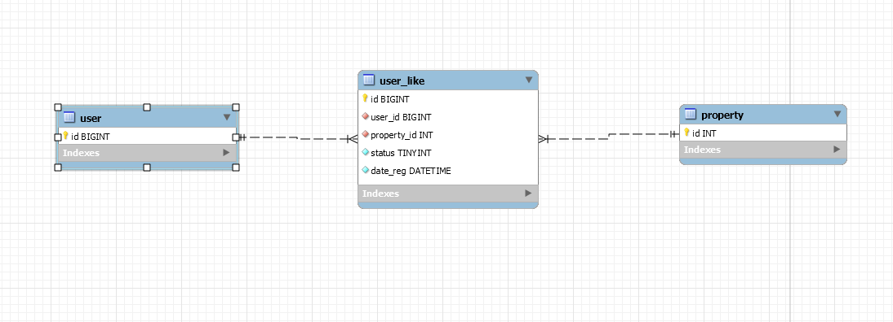
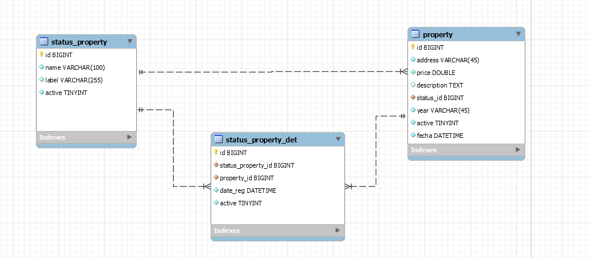

# Descripcion

### Tecnologias a usar:

**Este proyecto se estaria realizando con serverless framework, ya que es su forma de trabajar**
- Como modulos de python adicionales, se uso:
    - mysql connector para las conecciones de las base de datos y consultas
    - unittest para las pruebas unitarias de la aplicacions
- para los plugins del serverless framework, se usaron los siguientes:
    - serverless-offline para el deploy en local de la aplicacion
    - serverless-dotenv-plugin para el manejo de .envs en la aplicacion

**Para Ejecutar el proyecto, se recomienda ejecutar los siguientes comando ya teniendo node y serverless framework instalados**
- `npm install serverless-offline --save-dev`
- `npm i -D serverless-dotenv-plugin`

**Teniendo python 3.8 instalado, ejecutar el siguiente comando:**
- `pip install -r requirements.txt`

**Y por ultimo ejecutar**
- `serverless offline`

**El proyecto correra en la ruta**
- [http://localhost:3000/dev/](http://localhost:3000/dev/)


**el unico endpoint habilitado es el siguiente:**
- /property metodo Get

**Los filtros que se puedes realizar, segun el requerimiento son los siguientes:**
- **year:** Entero
- **city:** Cadena de texto
- **status:** cadena de texto

De la siguiente manera:

- [http://localhost:3000/dev/property?year=2011&status=en_venta&city=bogota](http://localhost:3000/dev/property?year=2011&status=en_venta&city=bogota)

Del orden que se requera y los datos que se quiera

**Para correr los test ingresar el siguiente codigo:**
- `pytest`

# PARTE 2



Este es mi modelo propuesto para la parte de like, ya teniendo una tabla de usuarios y la de propiedades (por eso en la captura solo cuentan con id), Y esta tabla solo depende del id del usuario, de la propiedad que se escogio, fecha de registro de este like, y un status (Ya que el borrado de estos datos seran logicos, para la persistencia de datos)

### Codigo SQL
```
CREATE TABLE IF NOT EXISTS `user_like` (
  `id` BIGINT NOT NULL AUTO_INCREMENT,
  `user_id` BIGINT NOT NULL,
  `property_id` INT NOT NULL,
  `status` TINYINT NOT NULL DEFAULT 1,
  `date_reg` DATETIME NOT NULL DEFAULT CURRENT_TIMESTAMP,
  PRIMARY KEY (`id`),
  INDEX `fk_user_like_user_idx` (`user_id` ASC),
  INDEX `fk_user_like_property1_idx` (`property_id` ASC),
  CONSTRAINT `fk_user_like_user`
    FOREIGN KEY (`user_id`)
    REFERENCES `user` (`id`),
  CONSTRAINT `fk_user_like_property1`
    FOREIGN KEY (`property_id`)
    REFERENCES `property` (`id`))
ENGINE = InnoDB;`

```
# PROPUESTA MODELO (PUNTO EXTRA)



Esta es mi propuesta del modelo actual que se tiene, ayudaria mucho a la consulta ya que no tocaria buscar en el historial sino que la propia tabla property tiene el estado actualizado de la propiedad y ayudaria muchisimo las consultas sober la misma.