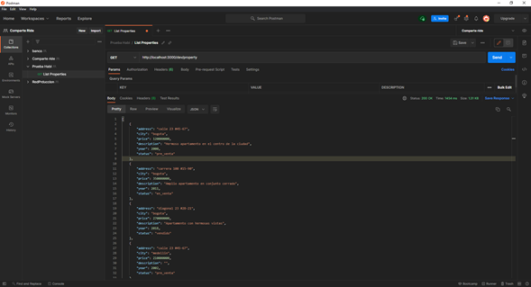
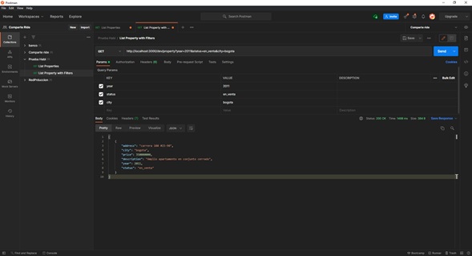

# Descripcion

### Tecnologias a usar:

**Este proyecto se realizo con serverless framework, ya que es su forma de trabajar, y como tecnologia, es una de las mas requeridas al momento de tener aplicaciones el aws con bajo precio y sin preocupacion del lado del servidor**
- Como módulos de python adicionales, se usó:
    - **mysql connecto**r para las conexiones de las base de datos y consultas
    - **unittest** para las pruebas unitarias de la aplicación
- para los plugins del serverless framework, se usaron los siguientes:
    - **serverless-offline** para el deploy en local de la aplicación
    - **serverless-dotenv-plugin** para el manejo de variables de entorno (.env) en la aplicación

**Para Ejecutar el proyecto, se recomienda ejecutar los siguientes comandos ya teniendo node y serverless framework instalados**
- `npm install serverless-offline --save-dev`
- `npm i -D serverless-dotenv-plugin`

**Teniendo python 3.8 instalado, ejecutar el siguiente comando:**
- `pip install -r requirements.txt`

**Y por ultimo, ejecutar:**
- `serverless offline`

**El proyecto correrá en la ruta:**
- [http://localhost:3000/dev/](http://localhost:3000/dev/)


**El único endpoint habilitado es el siguiente:**
- /property metodo Get

**Y se verá de la siguiente manera:**


**Los filtros que se pueden realizar, segun el requerimiento son los siguientes:**
- **year:** Entero
- **city:** Cadena de texto
- **status:** cadena de texto

De la siguiente manera:

- [http://localhost:3000/dev/property?year=2011&status=en_venta&city=bogota](http://localhost:3000/dev/property?year=2011&status=en_venta&city=bogota)

Del orden que se requiera y los datos que se quiera.

**Y se verá de la siguiente manera:**


**Para correr los test, ingresar el siguiente codigo:**
- `pytest`

### Nota:
En el punto 6 "*En el primer requerimiento, crear un archivo JSON con los datos que esperas que
lleguen del front con los filtros solicitados por el usuario.*", No creé el archivo JSON, ya que yo no recibo ningun dato de los filtros por json, sino que los recibo en la url, ya que en mis conocimientos, es como se maneja el filtrado en las apis.

# PARTE 2


Este es mi modelo propuesto para la parte de like, ya teniendo una tabla de usuarios y la de propiedades (por eso en la captura solo cuentan con id), Y esta tabla solo depende del id del usuario, de la propiedad que se escogio, fecha de registro de este like, y un status (Ya que el borrado de estos datos seran logicos, para la persistencia de datos)

### Codigo SQL
```
CREATE TABLE IF NOT EXISTS `user_like` (
  `id` BIGINT NOT NULL AUTO_INCREMENT,
  `user_id` BIGINT NOT NULL,
  `property_id` INT NOT NULL,
  `status` TINYINT NOT NULL DEFAULT 1,
  `date_reg` DATETIME NOT NULL DEFAULT CURRENT_TIMESTAMP,
  PRIMARY KEY (`id`),
  INDEX `fk_user_like_user_idx` (`user_id` ASC),
  INDEX `fk_user_like_property1_idx` (`property_id` ASC),
  CONSTRAINT `fk_user_like_user`
    FOREIGN KEY (`user_id`)
    REFERENCES `user` (`id`),
  CONSTRAINT `fk_user_like_property1`
    FOREIGN KEY (`property_id`)
    REFERENCES `property` (`id`))
ENGINE = InnoDB;`

```
# PROPUESTA MODELO (PUNTO EXTRA)


Esta es mi propuesta del modelo actual que se tiene, ayudaria mucho a la consulta ya que no tocaria buscar en el historial sino que la propia tabla property tiene el estado de la propiedad que se estara actualizando cada vez que la propiedad cambie de estado, y ayudaria muchisimo las consultas sober la misma.